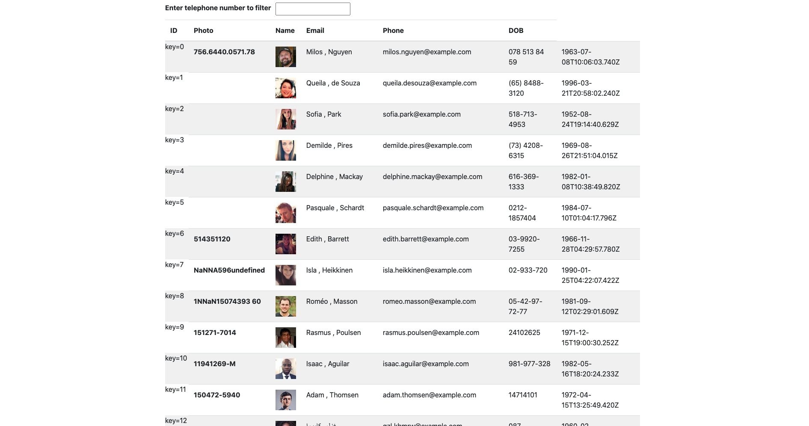

# 
 Employee Profile Generator 

## Description
The application uses a [Random User API](https://randomuser.me/) to create a queryable employee directory with React. The website pulls in data from its API and shows it in an easy to read table. The employees can be filtered by searching for a specific phone number. Additionally, when the "Name" category is clicked, the employees will be sorted by their name alphabetically, descending and ascending. 

## Table of Contents
* [Description](#Description)
* [Built With](#built-with)
* [Demo](#demo)
* [Authors](#authors)
* [License](#license)git 

## Built With
* HTML
* CSS
* Javascript
* React/JSx

## Demo

Visit the deployed website here https://ayannaaziz.github.io/Employee-Directory/

* Screenshot of application 

## Authors
Alma Aziz

## MIT License

Copyright (c) 2021 Ayanna Aziz

Permission is hereby granted, free of charge, to any person obtaining a copy
of this software and associated documentation files (the "Software"), to deal
in the Software without restriction, including without limitation the rights
to use, copy, modify, merge, publish, distribute, sublicense, and/or sell
copies of the Software, and to permit persons to whom the Software is
furnished to do so, subject to the following conditions:

The above copyright notice and this permission notice shall be included in all
copies or substantial portions of the Software.

THE SOFTWARE IS PROVIDED "AS IS", WITHOUT WARRANTY OF ANY KIND, EXPRESS OR
IMPLIED, INCLUDING BUT NOT LIMITED TO THE WARRANTIES OF MERCHANTABILITY,
FITNESS FOR A PARTICULAR PURPOSE AND NONINFRINGEMENT. IN NO EVENT SHALL THE
AUTHORS OR COPYRIGHT HOLDERS BE LIABLE FOR ANY CLAIM, DAMAGES OR OTHER
LIABILITY, WHETHER IN AN ACTION OF CONTRACT, TORT OR OTHERWISE, ARISING FROM,
OUT OF OR IN CONNECTION WITH THE SOFTWARE OR THE USE OR OTHER DEALINGS IN THE
SOFTWARE.

